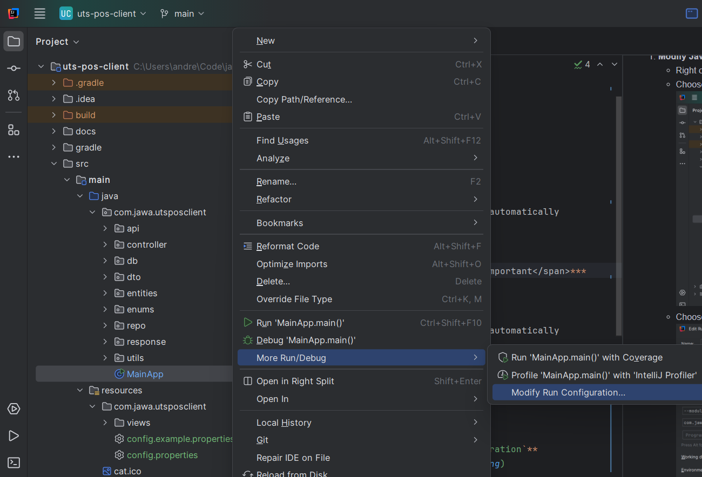
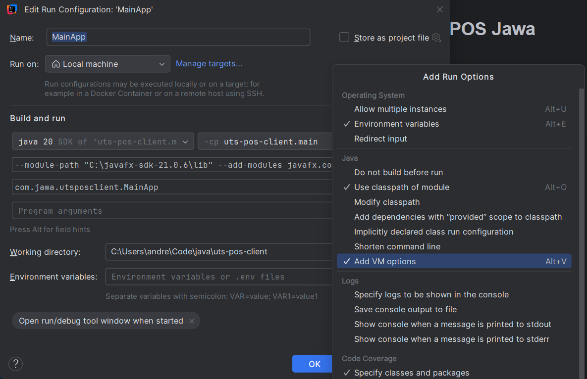

# Client POS Jawa

[CATATAN APLIKASI UNTUK PENGEMBANG](docs/NOTES.md)

## Table of Content

- [Requirements](#requirements)
- [How to use](#how-to-use)

## Requirements

- **Java Development Kit (JDK) 20 atau or later**
  
  [Download here](https://www.oracle.com/java/technologies/javase/jdk20-archive-downloads.html) or IntelliJ will download it automatically

- **JavaFX SDK 21.0.6 or later**
  
  [Download here](https://gluonhq.com/products/javafx/)

- **Gradle 8.8 or later**

  [Downlaod here](https://gradle.org/releases/) or IntelliJ will download it automatically

## How To Use

### 1. IntelliJ IDEA

1. **Modify Run Configuration:**
   - Right click on `MainApp.java`
   - Choose **`More Run/Debug` > `Modify Run Configuration`**
    
   - Choose **Add VM options** in **Modify options** menu
    
   - In the `VM options` field add:
      ```
      --module-path "$PATH_TO_JAVAFX_SDK_LIB" --add-modules javafx.controls,javafx.fxml 
      ```
      example:
      ```
      --module-path "C:\javafx-sdk-21.0.6\lib" --add-modules javafx.controls,javafx.fxml 
      ```
   - Apply and OK

2. **Run server ([uts-pos-server](https://github.com/andreasmlbngaol/uts-pos-server))**
3. **Run application**