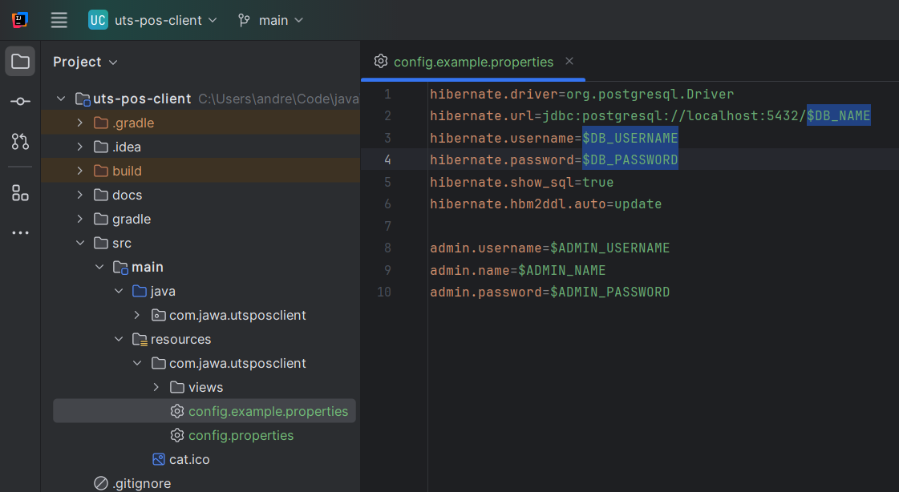
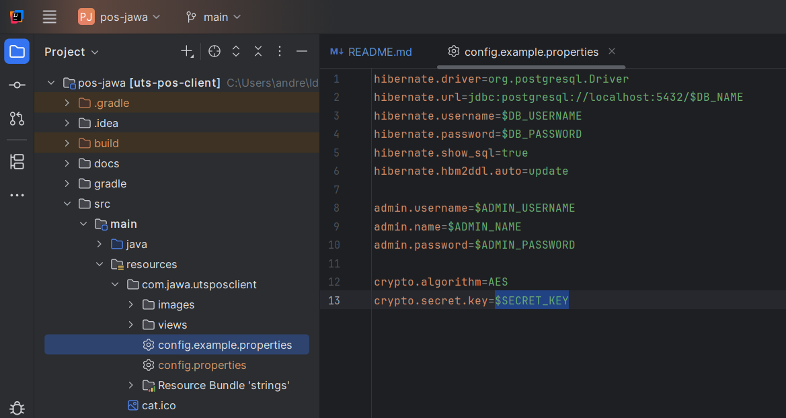

# Jawa Market POS Application

## Table of Content

- [Requirements](#requirements)
- [How to use](#how-to-use)
- [Libraries Used](#libraries-and-technologies-used)


## Requirements

- **Java Development Kit (JDK) 20 or later**
  
  [Download here](https://www.oracle.com/java/technologies/javase/jdk20-archive-downloads.html) or IntelliJ will download it automatically

- **JavaFX SDK 21.0.6 or later**
  
  [Download here](https://gluonhq.com/products/javafx/) ***<span style="color:red">!important</span>***

- **Gradle 8.8 or later**

  [Download here](https://gradle.org/releases/) or IntelliJ will download it automatically


## How To Use

### 1. IntelliJ IDEA

1. **Modify JavaFX Runtime Configuration:**
   - Right-click on `MainApp.java`
   - Choose **`More Run/Debug` > `Modify Run Configuration`**
    
   - Choose **Add VM options** in the **Modify options** menu
    
   - In the `VM options` field add:
      ```
      --module-path "$PATH_TO_JAVAFX_SDK_LIB" --add-modules javafx.controls,javafx.fxml 
      ```
      example:
      ```
      --module-path "C:\javafx-sdk-21.0.6\lib" --add-modules javafx.controls,javafx.fxml 
      ```
   - Apply and OK

2. **Modify Database and Default Admin Configuration:**
    - Create a new empty database in PostgreSQL
        ```postgresql
        CREATE DATABASE db_name;
        ```
    - Open [**config.example.properties**](src/main/resources/com/jawa/utsposclient/config.example.properties) in `/src/main/resources/com/jawa/utsposclient/`
    - Change `DB_NAME`, `DB_USERNAME`, `DB_PASSWORD` with your own database configuration
        
    - Change `ADMIN_USERNAME`, `ADMIN_NAME`, `ADMIN_PASSWORD` as you like
        
3. **Modify Session Secret Key:**
    - Open [**config.example.properties**](src/main/resources/com/jawa/utsposclient/config.example.properties) in `/src/main/resources/com/jawa/utsposclient/`
    - Change `SECRET_KEY` as you want
        
    - Rename the file name `config.example.properties` to `config.properties`
4. **Run application**


## Libraries and Technologies Used

The following libraries are used in this project:

- **JavaFX Controls**  
  Provides a set of UI controls (like buttons, labels, text fields, etc.) to build the graphical user interface (GUI) of the application.


- **JavaFX FXML**  
  Used for defining the user interface in an XML-based format (FXML), allowing for a clean separation between the UI design and application logic.


- **PostgreSQL JDBC Driver**  
  A JDBC driver for connecting the Java application to PostgreSQL databases, enabling data retrieval, insertion, and management.


- **Hibernate Core**  
  An Object-Relational Mapping (ORM) framework that maps Java objects to relational database tables, simplifying database interactions and reducing boilerplate code.


- **JBCrypt**  
  A library for securely hashing passwords using the bcrypt algorithm. It provides a strong encryption mechanism for user authentication.


- **Ikonli**  
  A library for incorporating scalable vector icons into JavaFX applications, providing access to a wide range of popular icon sets.


- **Material Icons**  
  A library for integrating Google's Material Design icons into JavaFX applications, giving a modern, consistent look across platforms.

These libraries are essential to the functionality and user interface of the application. For more details on how to configure and use them, refer to the [`build.gradle.kts`](build.gradle.kts) file in the project.
